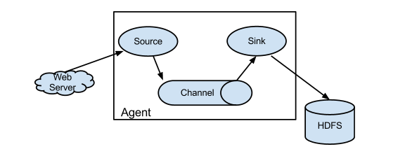
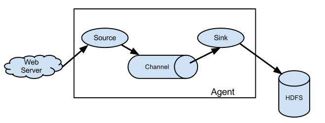
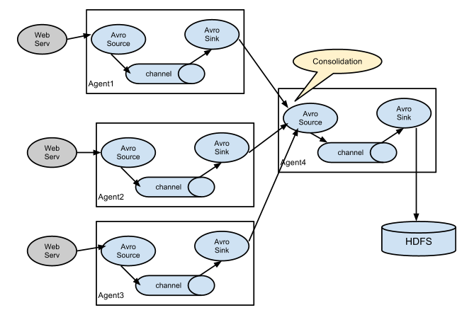
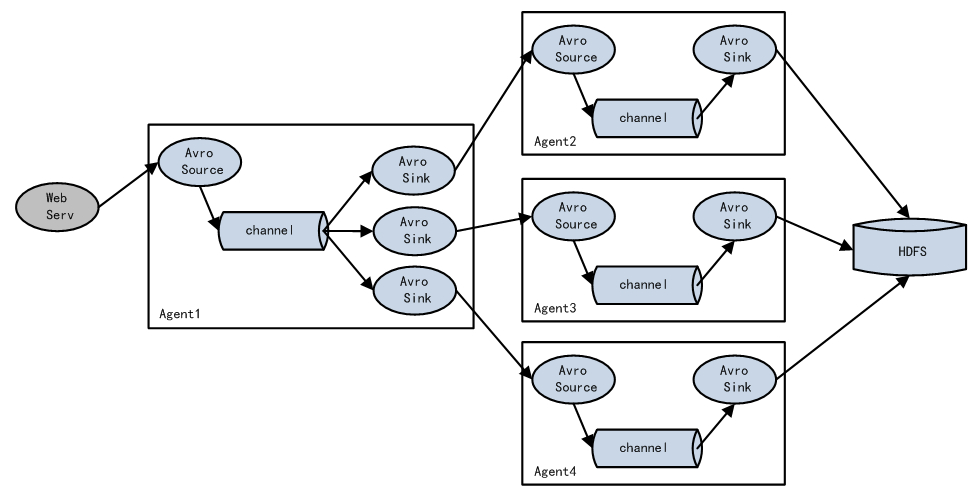

# 1 Fluem概述

Flume是Cloudera提供的一个高可用的，高可靠的，分布式的海量日志采集、聚合和传输的软件。  
Flume的核心是把数据从数据源(source)收集过来，再将收集到的数据送到指定的目的地(sink)。为了保证输送的过程一定成功，在送到目的地(sink)之前，会先缓存数据(channel),待数据真正到达目的地(sink)后，flume在删除自己缓存的数据。  
Flume支持定制各类数据发送方，用于收集各类型数据；同时，Flume支持定制各种数据接受方，用于最终存储数据。一般的采集需求，通过对flume的简单配置即可实现。针对特殊场景也具备良好的自定义扩展能力。因此，flume可以适用于大部分的日常数据采集场景。  
当前Flume有两个版本。Flume 0.9X版本的统称Flume OG（original generation），Flume1.X版本的统称Flume NG（next generation）。由于Flume NG经过核心组件、核心配置以及代码架构重构，与Flume OG有很大不同，使用时请注意区分。改动的另一原因是将Flume纳入 apache 旗下，Cloudera Flume 改名为 Apache Flume。  

# 2 运行机制

Flume系统中核心的角色是agent，agent本身是一个Java进程，一般运行在日志收集节点。

每一个agent相当于一个数据传递员，内部有三个组件：  
Source：采集源，用于跟数据源对接，以获取数据；  
Sink：下沉地，采集数据的传送目的，用于往下一级agent传递数据或者往最终存储系统传递数据；
Channel：agent内部的数据传输通道，用于从source将数据传递到sink；  
在整个数据的传输的过程中，流动的是event，它是Flume内部数据传输的最基本单元。event将传输的数据进行封装。如果是文本文件，通常是一行记录，event也是事务的基本单位。event从source，流向channel，再到sink，本身为一个字节数组，并可携带headers(头信息)信息。event代表着一个数据的最小完整单元，从外部数据源来，向外部的目的地去。  
一个完整的event包括：event headers、event body、event信息，其中event信息就是flume收集到的日记记录。  

# 3 Flume采集系统结构图

## 3.1 简单结构

单个agent采集数据


## 3.2 复杂结构

多级agent之间串联


# 4 Flume安装部署

Flume的安装非常简单  
上传安装包到数据源所在节点上  
然后解压tar -zxvf apache-flume-1.8.0-bin.tar.gz  
然后进入flume的目录，修改conf下的flume-env.sh，在里面配置JAVA_HOME  
根据数据采集需求配置采集方案，描述在配置文件中(文件名可任意自定义)  
指定采集方案配置文件，在相应的节点上启动flume agent  

先用一个最简单的例子来测试一下程序环境是否正常  
1）先在flume的conf目录下新建一个文件

```shell
vim   netcat-logger.conf
```

```shell
# 定义这个agent中各组件的名字
a1.sources = r1
a1.sinks = k1
a1.channels = c1

# 描述和配置source组件：r1
a1.sources.r1.type = netcat
a1.sources.r1.bind = localhost
a1.sources.r1.port = 44444

# 描述和配置sink组件：k1
a1.sinks.k1.type = logger

# 描述和配置channel组件，此处使用是内存缓存的方式
a1.channels.c1.type = memory
a1.channels.c1.capacity = 1000
a1.channels.c1.transactionCapacity = 100

# 描述和配置source  channel   sink之间的连接关系
a1.sources.r1.channels = c1
a1.sinks.k1.channel = c1
```

2)启动agent去采集数据  

```shell
bin/flume-ng agent \
-c conf \
-f conf/netcat-logger.conf \
-n a1  \
-Dflume.root.logger=INFO,console
```

-c conf   指定flume自身的配置文件所在目录  
-f conf/netcat-logger.con指定我们所描述的采集方案  
-n a1  指定我们这个agent的名字  

3)测试  
先要往agent采集监听的端口上发送数据，让agent有数据可采。  
随便在一个能跟agent节点联网的机器上：  
telnet anget-hostname  port   （telnet localhost 44444）  

# 5 采集目录到HDFS

采集需求：服务器的某特定目录下，会不断产生新的文件，每当有新文件出现，就需要把文件采集到HDFS中去  
根据需求，首先定义以下3大要素  
采集源，即source——监控文件目录：spooldir  
下沉目标，即sink——HDFS文件系统：hdfs sink  
source和sink之间的传递通道——channel，可用file channel 也可以用内存channel  
配置文件编写：  

```shell
# Name the components on this agent
a1.sources = r1
a1.sinks = k1
a1.channels = c1

# Describe/configure the source
##注意：不能往监控目中重复丢同名文件
a1.sources.r1.type = spooldir
a1.sources.r1.spoolDir = /root/logs
a1.sources.r1.fileHeader = true

# Describe the sink
a1.sinks.k1.type = hdfs
a1.sinks.k1.hdfs.path = /flume/events/%y-%m-%d/%H%M/
a1.sinks.k1.hdfs.filePrefix = events-
a1.sinks.k1.hdfs.round = true
a1.sinks.k1.hdfs.roundValue = 10
a1.sinks.k1.hdfs.roundUnit = minute
a1.sinks.k1.hdfs.rollInterval = 3
a1.sinks.k1.hdfs.rollSize = 20
a1.sinks.k1.hdfs.rollCount = 5
a1.sinks.k1.hdfs.batchSize = 1
a1.sinks.k1.hdfs.useLocalTimeStamp = true
#生成的文件类型，默认是Sequencefile，可用DataStream，则为普通文本
a1.sinks.k1.hdfs.fileType = DataStream

# Use a channel which buffers events in memory
a1.channels.c1.type = memory
a1.channels.c1.capacity = 1000
a1.channels.c1.transactionCapacity = 100

# Bind the source and sink to the channel
a1.sources.r1.channels = c1
a1.sinks.k1.channel = c1
```

Channel参数解释：  
capacity：默认该通道中最大的可以存储的event数量  
trasactionCapacity：每次最大可以从source中拿到或者送到sink中的event数量  

# 6 采集文件到hdfs

采集需求：比如业务系统使用log4j生成的日志，日志内容不断增加，需要把追加到日志文件中的数据实时采集到hdfs  
根据需求，首先定义以下3大要素  
采集源，即source——监控文件内容更新：exec 'tail -F file'  
下沉目标，即sink——HDFS文件系统:hdfs sink  
Source和sink之间的传递通道——channel，可用file channel也可以用内存channel  
配置文件编写：  

```shell
# Name the components on this agent
a1.sources = r1
a1.sinks = k1
a1.channels = c1

# Describe/configure the source
a1.sources.r1.type = exec
a1.sources.r1.command = tail -F /root/logs/test.log
a1.sources.r1.channels = c1

# Describe the sink
a1.sinks.k1.type = hdfs
a1.sinks.k1.hdfs.path = /flume/tailout/%y-%m-%d/%H%M/
a1.sinks.k1.hdfs.filePrefix = events-
a1.sinks.k1.hdfs.round = true
a1.sinks.k1.hdfs.roundValue = 10
a1.sinks.k1.hdfs.roundUnit = minute
a1.sinks.k1.hdfs.rollInterval = 3
a1.sinks.k1.hdfs.rollSize = 20
a1.sinks.k1.hdfs.rollCount = 5
a1.sinks.k1.hdfs.batchSize = 1
a1.sinks.k1.hdfs.useLocalTimeStamp = true
#生成的文件类型，默认是Sequencefile，可用DataStream，则为普通文本
a1.sinks.k1.hdfs.fileType = DataStream

# Use a channel which buffers events in memory
a1.channels.c1.type = memory
a1.channels.c1.capacity = 1000
a1.channels.c1.transactionCapacity = 100

# Bind the source and sink to the channel
a1.sources.r1.channels = c1
a1.sinks.k1.channel = c1
```

参数解析：

- rollInterval
默认值：30  
hdfs sink间隔多长将临时文件滚动成最终目标文件，单位：秒；  
如果设置成0，则表示不根据时间来滚动文件；  
注：滚动（roll）指的是，hdfs sink将临时文件重命名成最终目标文件，并新打开一个临时文件来写入数据；  
- rollSize
默认值：1024  
当临时文件达到该大小（单位：bytes）时，滚动成目标文件；  
如果设置成0，则表示不根据临时文件大小来滚动文件；  
- rollCount  
默认值：10  
当events数据达到该数量时候，将临时文件滚动成目标文件；  
如果设置成0，则表示不根据events数据来滚动文件；  
- round  
默认值：false  
是否启用时间上的“舍弃”，这里的“舍弃”，类似于“四舍五入”。  
- roundValue  
默认值：1  
时间上进行“舍弃”的值；  
- roundUnit  
默认值：seconds  
时间上进行“舍弃”的单位，包含：second,minute,hour  
示例：  
a1.sinks.k1.hdfs.path = /flume/events/%y-%m-%d/%H%M/%S  
a1.sinks.k1.hdfs.round = true  
a1.sinks.k1.hdfs.roundValue = 10  
a1.sinks.k1.hdfs.roundUnit = minute  
当时间为2015-10-16 17:38:59时候，hdfs.path依然会被解析为：  
/flume/events/20151016/17:30/00  
因为设置的是舍弃10分钟内的时间，因此，该目录每10分钟新生成一个。  

# 7 Flume的load-balance\failover

负载均衡是用于解决一台机器(一个进程)无法解决所有请求而产生的一种算法。Load balancing Sink Processor能够实现load balance功能，如下图Agent1是一个路由节点，负责将Channel暂存的Event均衡到对应的多个Sink组件上，而每个Sink组件分别连接到一个独立的Agent上，示例配置，如下所示：


```shell
a1.sinkgroups = g1
a1.sinkgroups.g1.sinks = k1 k2 k3
a1.sinkgroups.g1.processor.type = load_balance
a1.sinkgroups.g1.processor.backoff = true  #如果开启，则将失败的sink放入黑名单
a1.sinkgroups.g1.processor.selector = round_robin  # 另外还支持random
a1.sinkgroups.g1.processor.selector.maxTimeOut=10000 #在黑名单放置的超时时间，超时结束时，若仍然无法接收，则超时时间呈指数增长
```

Failover Sink Processor能够实现failover功能，具体流程类似load balance，但是内部处理机制与load balance完全不同。  
Failover Sink Processor维护一个优先级Sink组件列表，只要有一个Sink组件可用，Event就被传递到下一个组件。故障转移机制的作用是将失败的Sink降级到一个池，在这些池中它们被分配一个冷却时间，随着故障的连续，在重试之前冷却时间增加。一旦Sink成功发送一个事件，它将恢复到活动池。 Sink具有与之相关的优先级，数量越大，优先级越高。  
例如，具有优先级为100的sink在优先级为80的Sink之前被激活。如果在发送事件时汇聚失败，则接下来将尝试下一个具有最高优先级的Sink发送事件。如果没有指定优先级，则根据在配置中指定Sink的顺序来确定优先级。  
示例配置如下所示：  

```shell
a1.sinkgroups = g1
a1.sinkgroups.g1.sinks = k1 k2 k3
a1.sinkgroups.g1.processor.type = failover
a1.sinkgroups.g1.processor.priority.k1 = 5  #优先级值, 绝对值越大表示优先级越高
a1.sinkgroups.g1.processor.priority.k2 = 7
a1.sinkgroups.g1.processor.priority.k3 = 6
a1.sinkgroups.g1.processor.maxpenalty = 20000  #失败的Sink的最大回退期（millis）
```

