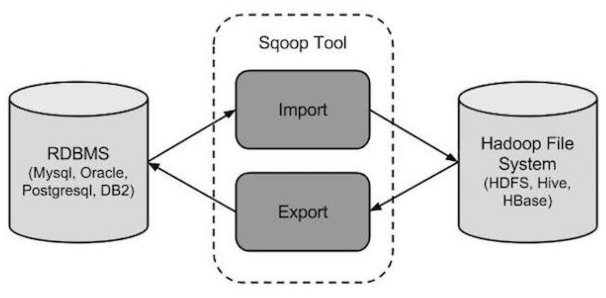

# 1 Sqoop介绍

- Apache Sqoop是在Hadoop生态体系和RDBMS体系之间传送数据的一种工具。来自于 Apache 软件基金会提供。
- Sqoop工作机制是将导入或导出命令翻译成 mapreduce 程序来实现。在翻译出的 mapreduce中主要是对inputformat 和 outputformat 进行定制。
- Hadoop生态系统包括：HDFS、Hive、Hbase等
- RDBMS体系包括：Mysql、Oracle、DB2等
- Sqoop可以理解为:"SQL到Hadoop和Hadoop到SQL".

- 站在Apache立场看待数据流转问题,可以分为数据的导入导出:
  - Import:数据导入.RDBMS----->Hadoop
  - Export:数据导出.Hadoop---->RDBMS

# 2 Sqoop安装

- 安装sqoop的前提是已经具备java和hadoop 的环境。
- 最新稳定版：1.4.6
- 配置文件修改:  
cd $SQOOP_HOME/conf
mv sqoop-env-template.sh sqoop-env.sh
vim sqoop-env.sh
export HADOOP_COMMON_HOME=/export/servers/hadoop-2.7.5
export HADOOP_MAPRED_HOME=/export/servers/hadoop-2.7.5
export HIVE_HOME=/export/servers/hive
- 上述配置仅与hadoop和hive进行了集成
- 加入mysql的jdbc驱动包
cp /hive/lib/mysql-connector-java-5.1.32.jar $SQOOP_HOME/lib/
- 验证启动  
bin/sqoop list-databases \
--connect jdbc:mysql://localhost:3306/ \
--username root \
--password hadoop
- 该验证启动的脚本可以显示mysql的所有数据库

# 3 sqoop的导入

- "导入工具"导入单个表从RDBMS到HDFS.表中的每一行被视为HDFS的记录。所有记录都存储为文本文件的文本数据
- 下面的语法用于将数据导入HDFS  
$ sqoop import (generic-args) (import-args)
- Sqoop测试表数据  
在mysql中创建数据库userdb,然后执行userdb.sql脚本:  
创建三张表: emp 雇员表、 emp_add 雇员地址表、 emp_conn 雇员联系表

## 3.1 全量导入mysql表数据到HDFS

下面的命令用于从MySQL数据库服务器中的emp表导入HDFS  
bin/sqoop import \  
--connect jdbc:mysql://node-1:3306/userdb \  
--username root \  
--password hadoop \  
--delete-target-dir \  
--target-dir /sqoopresult \  
--table emp  
--m 1  
其中--target-dir可以用来指定导出数据存放至HDFS的目录;  
为了验证在HDFS导入的数据,使用以下命令查看导入的数据:  
hdfs dfs -ls /sqoopresult  
hdfs dfs -cat /sqoopresult/part-m-00000  
可以看出它会在 HDFS 上默认用逗号,分隔 emp 表的数据和字段  
可以通过--fields-terminated-by '\t'来指定分隔符

- 显示的数据如下：  
- 1201,gopal,manager,50000,TP  
- 1202,manisha,Proof reader,50000,TP  
- 1203,khalil,php dev,30000,AC
- 1204,prasanth,php dev,30000,AC
- 1205,kranthi,admin,20000,TP

## 3.2 全量导入mysql表数据到HIVE

### 3.1 方式一：先复制表结构到 hive 中再导入数据

将关系型数据的表结构复制到hive中  
bin/sqoop create-hive-table \  
--connect jdbc:mysql://node-1:3306/sqoopdb \  
--table emp_add \  
--username root \  
--password hadoop \  
--hive-table test.emp_add_sp  
其中：
--table emp_add为mysql中的数据库sqoopdb中的表
--hive-table emp_add_sp为hive中新建的表名称  

从关系数据库导入文件到hive中
bin/sqoop import \  
--connect jdbc:mysql://node-1:3306/sqoopdb \  
--username root \  
--password hadoop \  
--table emp_add \  
--hive-table test.emp_add_sp \  
--hive-import \  
--m 1  

### 3.2 方式二： 直接复制表结构数据到hive中

bin/sqoop import \  
--connect jdbc:mysql://node-1:3306/userdb \  
--username root \  
--password hadoop \  
--table emp_conn \  
--hive-import \  
--hive-database test \  
--m 1

### 3.3 导入表数据子集(where过滤)

--where可以指定从关系数据库导入数据时的查询条件  
它执行在数据库服务器相应的SQL查询，并将结果存储在HDFS的目标目录

bin/sqoop import \
--connect jdbc:mysql://node-1:3306/sqoopdb \
--username root \
--password hadoop \
--table emp_add \
--where "city ='sec-bad'" \
--target-dir /wherequery \
--m 1  

### 3.4 导入表数据子集(query查询)

注意事项:  
使用query sql语句来进行查找不能加参数--table;  
sql必须要添加where条件;  
where条件后面必须带一个$CONDITIONS这个字符串;  
sql语句必须用单引号,不能用双引号;
bin/sqoop import \  

--connect jdbc:mysql://node-1:3306/userdb \
--username root \
--password hadoop \
--target-dir /wherequery12 \
--query 'select id,name,deg from emp WHERE id>1203 and $CONDITIONS' \
--split-by id \
--fields-terminated-by '\t' \
--m 2

